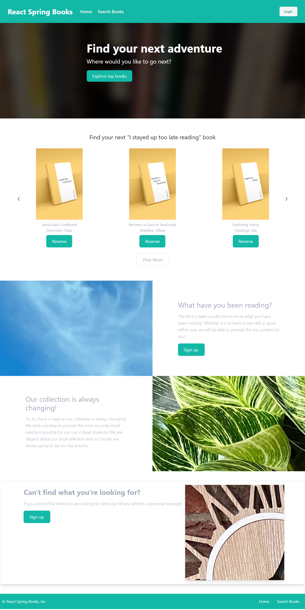
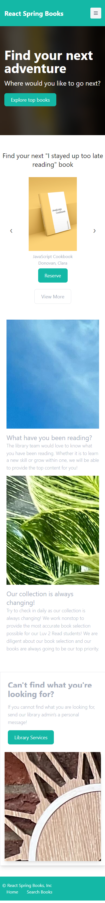

# React Spring Library

## Table of Contents

- [Description](#description)
- [Technologies](#technologies)
- [Installation](#installation)
- [Usage](#usage)
- [Screenshots](#screenshots)
- [License](#license)
- [Contributing](#contributing)
- [Tests](#tests)
- [Questions](#questions)

## Description

React Spring Library is a dynamic and user-friendly web application designed for book enthusiasts. This app offers a seamless experience for users to sign up, explore an extensive collection of books, and easily check out their favorites. After reading, users can leave reviews to share their thoughts and help other readers. Additionally, the app features a convenient messaging system, allowing users to communicate directly with the admin team for any assistance or inquiries. React Spring Library combines a robust set of features to enhance the reading experience and foster a vibrant community of book lovers.

## Technologies

- HTML5
- CSS3
- TypeScript
- React
- Vite
- MySQL
- AWS RDS
- Tailwind
- DaisyUi
- Okta Authentication

## Installation

Clone this repo

## Usage

Visit https://reactspringlibrary.netlify.app

## Screenshots

##### Desktop

##### Mobile

## License

Permission is hereby granted, free of charge, to any person obtaining a copy of this software and associated
documentation files (the "Software"), to deal in the Software without restriction, including without limitation the rights
to use, copy, modify, merge, publish, distribute, sublicense, and/or sell copies of the Software, and to permit persons to
whom the Software is furnished to do so, subject to the following conditions:

The above copyright notice and this permission notice shall be included in all copies or substantial portions of the Software.

THE SOFTWARE IS PROVIDED "AS IS", WITHOUT WARRANTY OF ANY KIND, EXPRESS OR IMPLIED,
INCLUDING BUT NOT LIMITED TO THE WARRANTIES OF MERCHANTABILITY, FITNESS FOR A PARTICULAR
PURPOSE AND NONINFRINGEMENT. IN NO EVENT SHALL THE AUTHORS OR COPYRIGHT HOLDERS BE LIABLE
FOR ANY CLAIM, DAMAGES OR OTHER LIABILITY, WHETHER IN AN ACTION OF CONTRACT, TORT OR
OTHERWISE, ARISING FROM, OUT OF OR IN CONNECTION WITH THE SOFTWARE OR THE USE OR OTHER
DEALINGS IN THE SOFTWARE. See more here [MIT](https://opensource.org/licenses/MIT)

## Contributing

N/A

## Tests

N/A

## Questions

You can submit any questions to:

[GitHub](https://github.com/mahiv87)

marcus.herrera.dev@gmail.com
